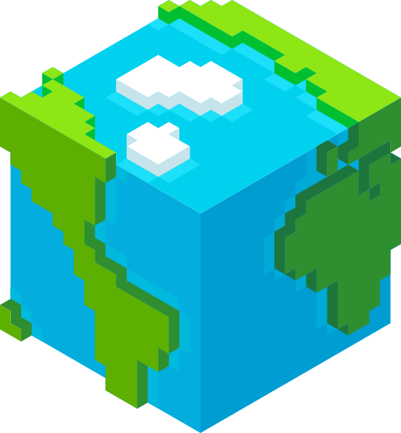
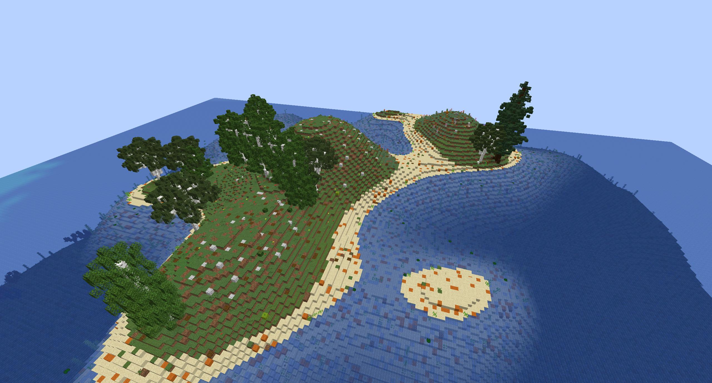

<!--
*** Thanks for checking out the Best-README-Template. If you have a suggestion
*** that would make this better, please fork the RealisticWorldGenerator Presets and create a pull request
*** or simply open an issue with the tag "enhancement".
*** Thanks again! Now go create something AMAZING! :D
***
***
***
*** To avoid retyping too much info. Do a search and replace for the following:
*** SourceWriters, RealisticWorldGenerator Presets, twitter_handle, email, RealisticWorldGenerator Presets, project_description
-->

<!-- PROJECT SHIELDS -->
<!--
*** I'm using markdown "reference style" links for readability.
*** Reference links are enclosed in brackets [ ] instead of parentheses ( ).
*** See the bottom of this document for the declaration of the reference variables
*** for contributors-url, forks-url, etc. This is an optional, concise syntax you may use.
*** https://www.markdownguide.org/basic-syntax/#reference-style-links
-->
[![Contributors][contributors-shield]][contributors-url]
[![Stargazers][stars-shield]][stars-url]
[![Issues][issues-shield]][issues-url]
[![The unlicense][license-shield]][license-url]

<!-- PROJECT LOGO -->
 

  

  <h3 align="center">RealisticWorldGenerator</h3>
  <h3 align="center">« Presets »</h3>

  

    <!-- TODO: project_description -->
     
    <a href="https://github.com/SourceWriters/rwg-presets/issues">Report Bug</a>
    ·
    <a href="https://github.com/SourceWriters/rwg-presets/issues">Request Preset</a>
  

<!-- TABLE OF CONTENTS -->

  
<h2 style="display: inline-block">Table of Contents</h2>

  <ol>
    <li><a href="#about-the-project">About The Project</a></li>
    <li><a href="#installation">Installation</a></li>
    <li><a href="#examples">Examples</a></li>
    <li><a href="#contributing">Contributing</a></li>
    <li><a href="#license">License</a></li>
    <li><a href="#contact">Contact</a></li>
  </ol>

<!-- GETTING STARTED -->
## About The Project
This project contains a lot of presets for the RealisticWorldGenerator Plugin for Spigot. It functionality is to provide easy access to all publicly available presets as long as our v5 Marketplace isn't out yet. 

Everyone who wants to is allowed to publish their presets here or to link another github project where they published the preset.  
More informations about that at <a href="#constributing">Contributing</a>

<!-- INSTALLATION -->
## Installation
As this repository only provides presets for RealisticWorldGenerator you need to own the Plugin.

You can get the Plugin at [Spigot][rwg-spigot-url] or [Polymart][rwg-polymart-url].  
If you already own the Plugin on Polymart we would recommend you to open a [Verification issue on our Gitlab][rwg-issue-url] for RWG to get access to the v4 of Spigot.

The process of installation is pretty easy.  
Just take the content of the `preset` folder of the preset you want and copy it into your `plugins/RealsiticWorld` directory.  
After that you should rename the world that the preset contained to the name of the world you would like to create with it.  
Then follow the normal RWG Installation steps to create a world and you're done.

<!-- CONTRIBUTING -->
## Examples

[**Islands**][preset-islands] by SyntaxPhoenix
 

 
[**GoodMC Extreme**][preset-goodmc] by GoodMC.ru
 

 

 

 

<!-- CONTRIBUTING -->
## Contributing

Contributions are what make the open source community such an amazing place to be learn, inspire, and create. Any contributions you make are **greatly appreciated**.

1. Fork the Project
2. Create your Preset Branch (`git checkout -b preset/AmazingPreset`)
3. Commit your Changes (`git commit -m 'Add a AmazingPreset'`)
4. Push to the Branch (`git push origin preset/AmazingPreset`)
5. Open a Pull Request

Each preset gets a folder where it can provide some information of itself as well as the preset itself or a github link to the repository of the preset.

<!-- LICENSE -->
## License

Distributed under the Unlicense. See `LICENSE` for more information.

<!-- CONTACT -->
## Contact

[@SyntaxPhoenix](https://twitter.com/SyntaxPhoenix) - support@syntaxphoenix.com

Project Link: [https://github.com/SourceWriters/rwg-presets](https://github.com/SourceWriters/rwg-presets)

<!-- MARKDOWN LINKS & IMAGES -->
<!-- https://www.markdownguide.org/basic-syntax/#reference-style-links -->
[contributors-shield]: https://img.shields.io/github/contributors/SourceWriters/rwg-presets.svg?style=flat-square
[contributors-url]: https://github.com/SourceWriters/rwg-presets/graphs/contributors
[stars-shield]: https://img.shields.io/github/stars/SourceWriters/rwg-presets.svg?style=flat-square
[stars-url]: https://github.com/SourceWriters/rwg-presets/stargazers
[issues-shield]: https://img.shields.io/github/issues/SourceWriters/rwg-presets.svg?style=flat-square
[issues-url]: https://github.com/SourceWriters/rwg-presets/issues
[license-shield]: https://img.shields.io/github/license/SourceWriters/rwg-presets.svg?style=flat-square
[license-url]: https://github.com/SourceWriters/rwg-presets/blob/master/LICENSE

[rwg-issue-url]: https://gitlab.com/SyntaxPhoenix/RealisticWorldApi/-/issues
[rwg-spigot-url]: https://www.spigotmc.org/resources/1-8-1-16-5-realisticworldgenerator.15905/
[rwg-polymart-url]: https://polymart.org/resource/realistic-world-generator.124/

[preset-goodmc]: https://github.com/SourceWriters/rwg-presets/tree/master/GoodMCExtreme
[preset-Islands]: https://github.com/SourceWriters/rwg-presets/tree/master/Islands
